# UML Diagrams — GrowthPilot AI

This document captures the current architecture of the repository as implemented in the codebase.

## 1) System context

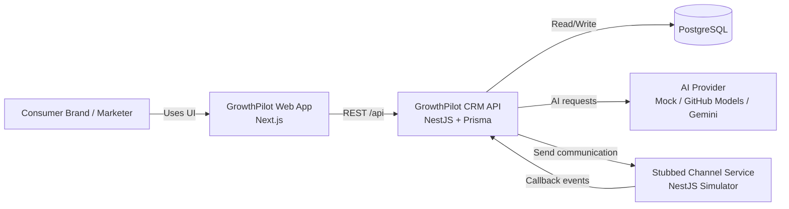

## 2) High-level component diagram

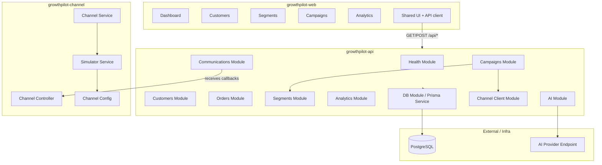

## 3) Backend module dependency diagram

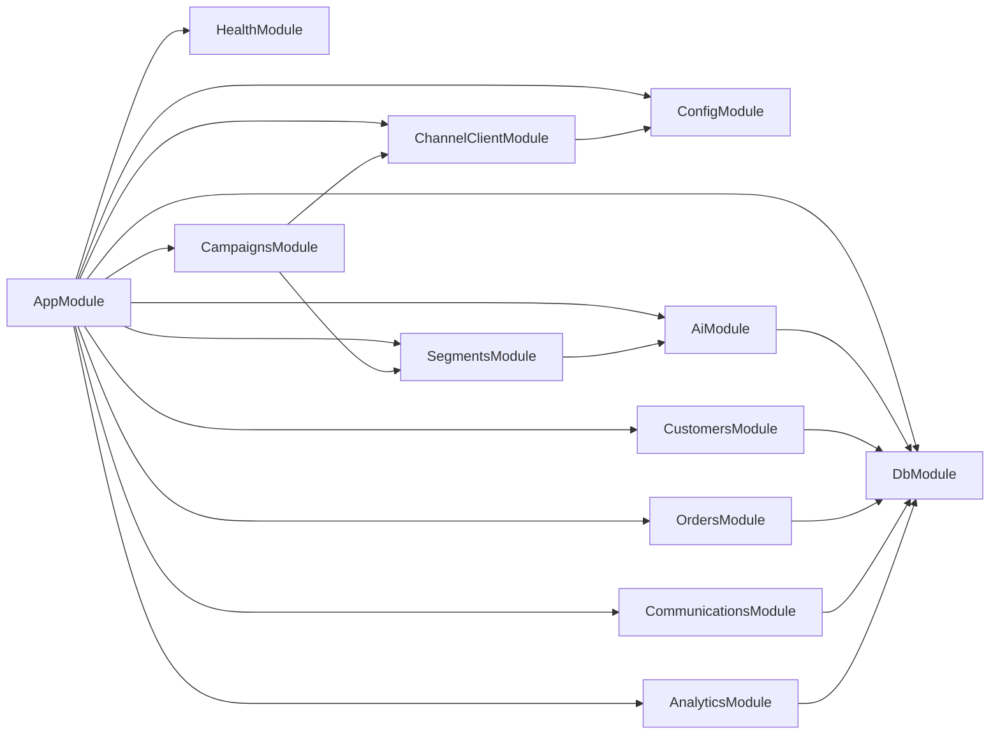

## 4) Core data model

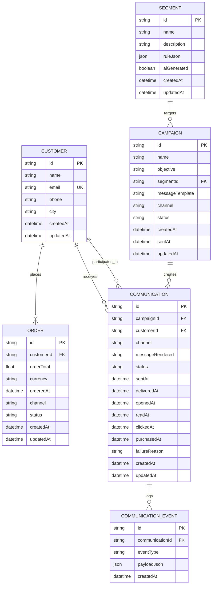

## 5) Campaign creation and send workflow

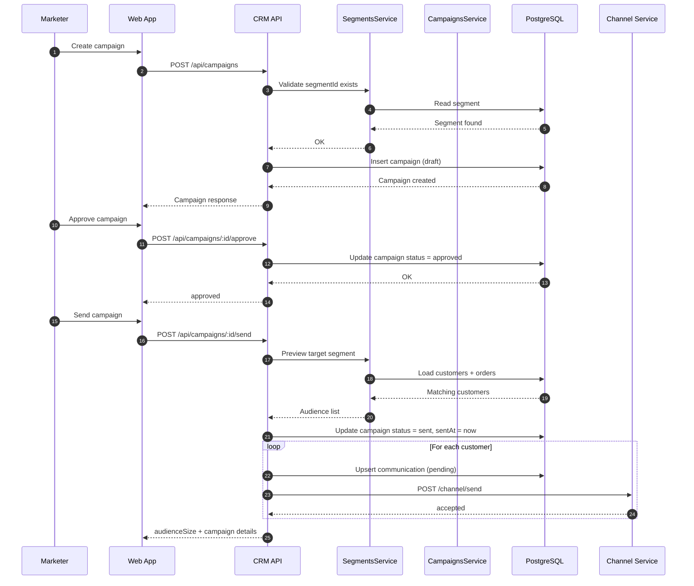

## 6) Channel callback lifecycle

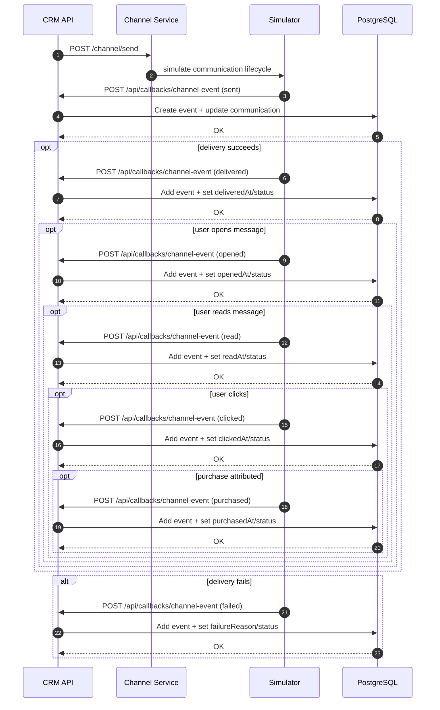

## 7) Segment rule evaluation

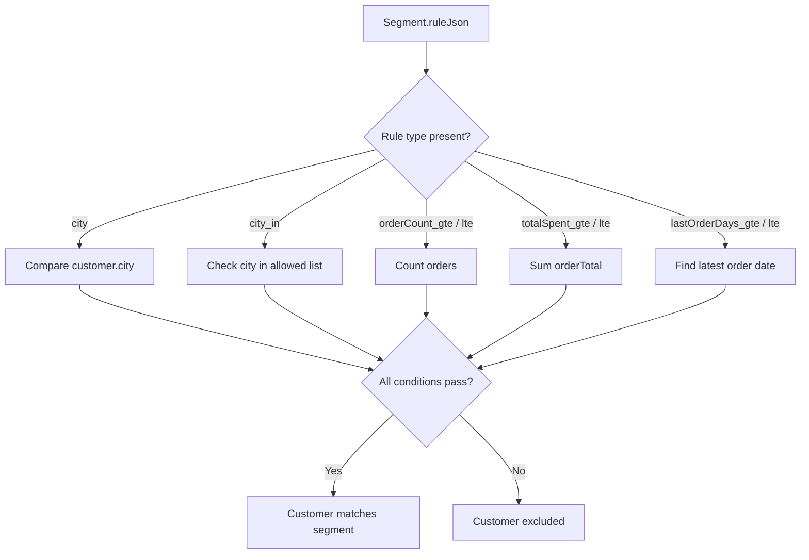

## 8) AI workflow

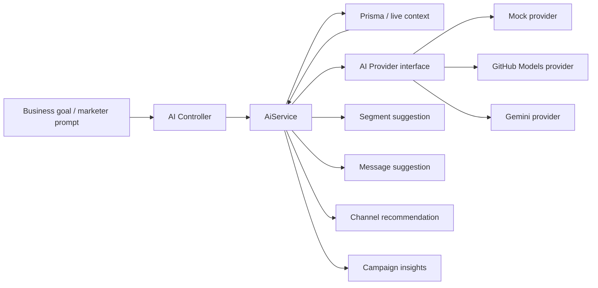

## 9) Analytics pipeline

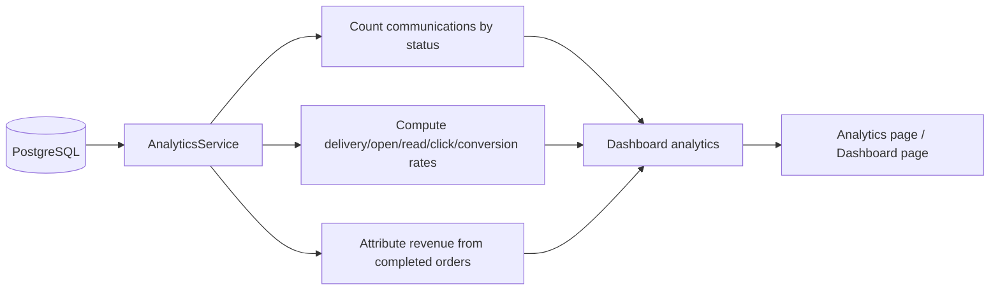

## 10) Deployment view

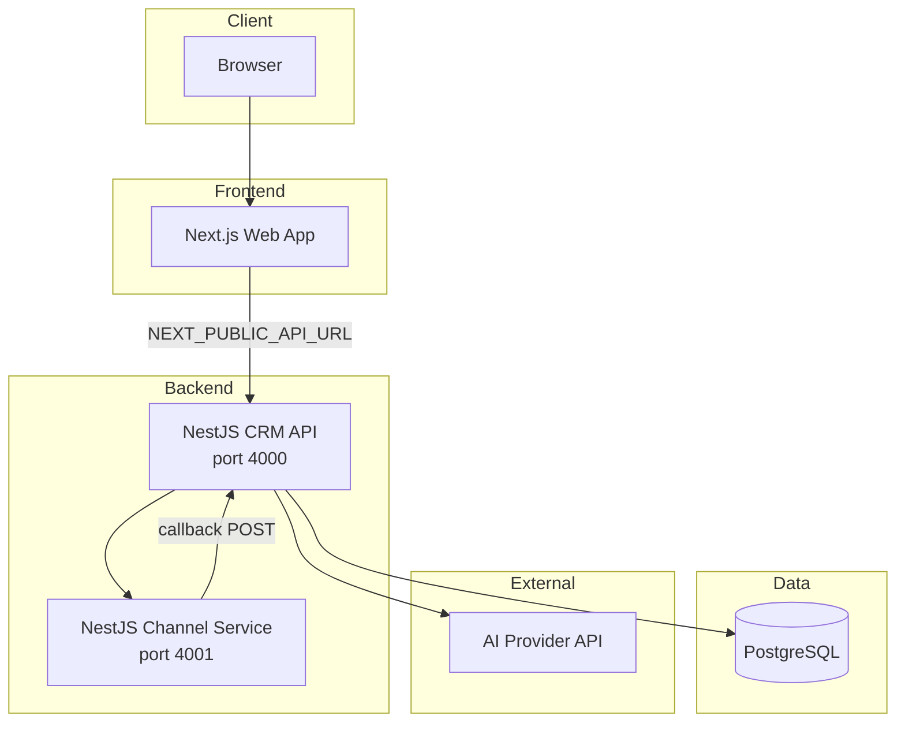

## 11) Request / route map

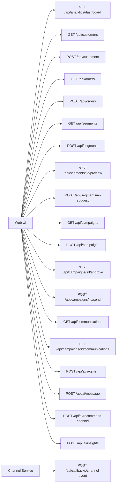

## 12) Design notes

- `Campaign` is a two-step lifecycle: `draft -> approved -> sent`.
- `Communication` is the atomic unit of delivery and attribution.
- Callback handling is idempotent at the `(communicationId, eventType)` level.
- Status progression is monotonic; later events only overwrite earlier states.
- Segment evaluation is rule-driven through `ruleJson`, not hardcoded per segment.
- AI is pluggable through an interface, so provider choice does not affect business logic.
- The channel service is intentionally stubbed and asynchronous to model real-world delivery systems.

## 13) What this project is solving

This repository implements a shopper outreach CRM, not a sales pipeline CRM. The core flow is:

1. ingest customers and orders,
2. build or generate segments,
3. create campaigns from those segments,
4. send messages through the stubbed channel service,
5. collect delivery/engagement callbacks,
6. surface analytics and attribution.

